# Smart Buy Client

## Table of Contents

- [Overview](#overview)
- [Features](#features)
- [Technology Stack](#technologies-used)
- [Installation](#installation)
- [Environment Variables](#environment-variables)
- [Project Structure](#project-structure)
- [Pages and Functionality](#pages-and-functionality)

## Overview
Smart Buy Client is the front-end application for the Smart Buy platform, designed to provide users with a seamless shopping experience. This project is built using modern web technologies to ensure performance, scalability, and maintainability. Smart Buy Client leverages generative neural networks to enhance the e-commerce experience by dynamically generating products, categories and personalized recommendations. This cutting-edge approach ensures a more engaging and tailored shopping journey for users.

## Features

- User-friendly interface for browsing and purchasing products.
- Responsive design for optimal viewing on all devices.
- Integration with the Smart Buy API for real-time data.
- Secure authentication and user management.
- User-friendly interface for browsing and purchasing products.
- Responsive design for optimal viewing on all devices.
- Integration with the Smart Buy API for real-time data.
- Secure authentication and user management.
- Utilization of neural networks for generating categories and products.

## Technologies Used
- **Framework**: React TypeScript
- **Styling**: MUI
- **State Management**: Redux-toolkit
- **Build Tool**: Vite
- **External API**: [OpenRouterAPI](https://openrouter.ai/), [Google AI Studio](https://aistudio.google.com/prompts/new_chat)

## Installation

1. Clone the repository:
  ```bash
  git clone https://github.com/CoderPavlo/smart-buy-front.git
  cd smart-buy-front
  ```

2. Install dependencies:
  ```bash
  npm install
  ```

3. Start the development server:
  ```bash
  npm run dev
  ```

4. Open your browser and navigate to `http://localhost:5173`.


## Environment Variables

Create a `.env` file in the root directory with the following values:
```env
# API Base URL
VITE_BASE_URL=http://localhost:8000/

# External API Keys
VITE_AI_KEY=your-openrouter-api-key
VITE_AI_GOOGLE_KEY=your-google-ai-studio-key

# External API URLS
VITE_AI_URL=https://openrouter.ai/api/v1/
VITE_AI_GOOGLE_URL=https://generativelanguage.googleapis.com/v1beta/models/gemini-2.0-flash-exp-image-generation:generateContent
```

## Project Structure

```
/smart-buy-client
├── public/                 # Static assets
│   ├── index.html          # Main HTML file
│   └── favicon.ico         # Favicon
├── src/                    # Source code
│   ├── components/         # Reusable React components
│   ├── hooks/              # Custom React hooks
│   ├── pages/              # Page components
│   ├── store/              # Redux store and slices
│   ├── models/             # Data models and types used across the application
│   ├── helpers/            # Config files
│   ├── layout/             # Layout components for consistent page structure
│   ├── utils/              # Utility functions
│   ├── App.tsx             # Main application component
│   ├── main.tsx            # Application entry point
│   ├── theme.ts            # Application theme
│   └── vite-env.d.ts       # TypeScript environment definitions
├── .env                    # Environment variables
├── .gitignore              # Git ignore rules
├── package.json            # Project dependencies and scripts
├── tsconfig.json           # TypeScript configuration
└── vite.config.ts          # Vite configuration
```

## Pages and Functionality

The application includes the following pages and routes, tailored for both regular users and administrators:

### 1. Login Page

- Displays the main login page for user authentication.

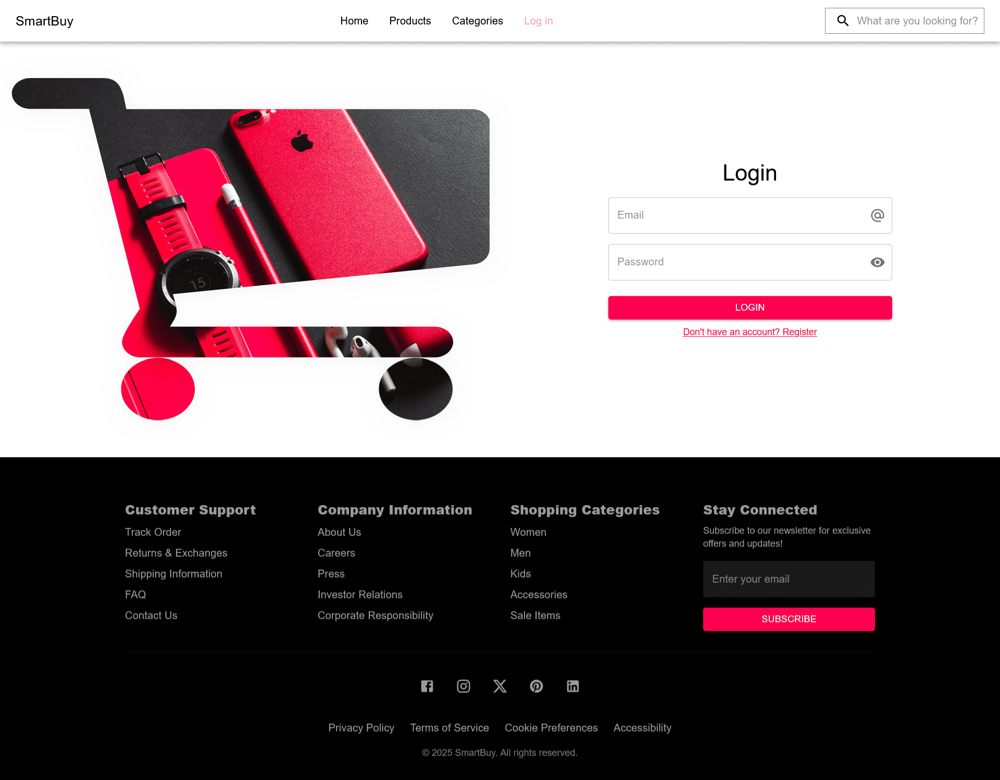

### 2. Admin Dashboard

- The default landing page for administrators, showing an overview of key metrics.

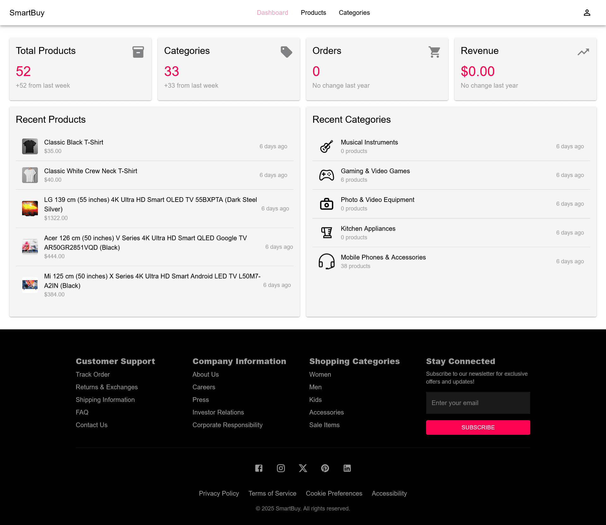

### 3. Admin Categories

- Enables administrators to manage product categories.

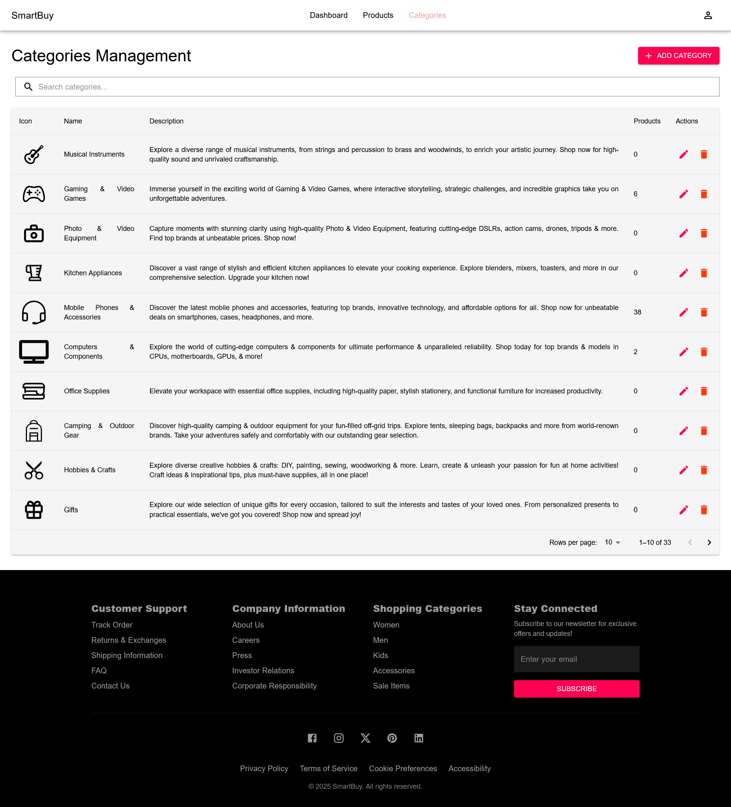

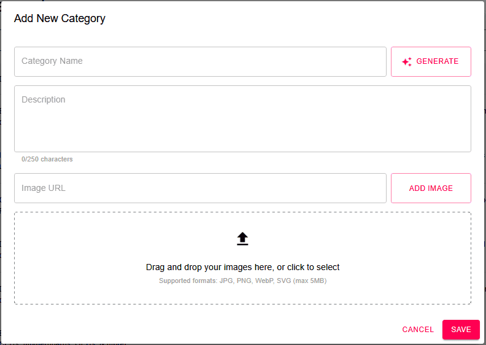

### 4. Admin Products

- Allows administrators to manage the product catalog.

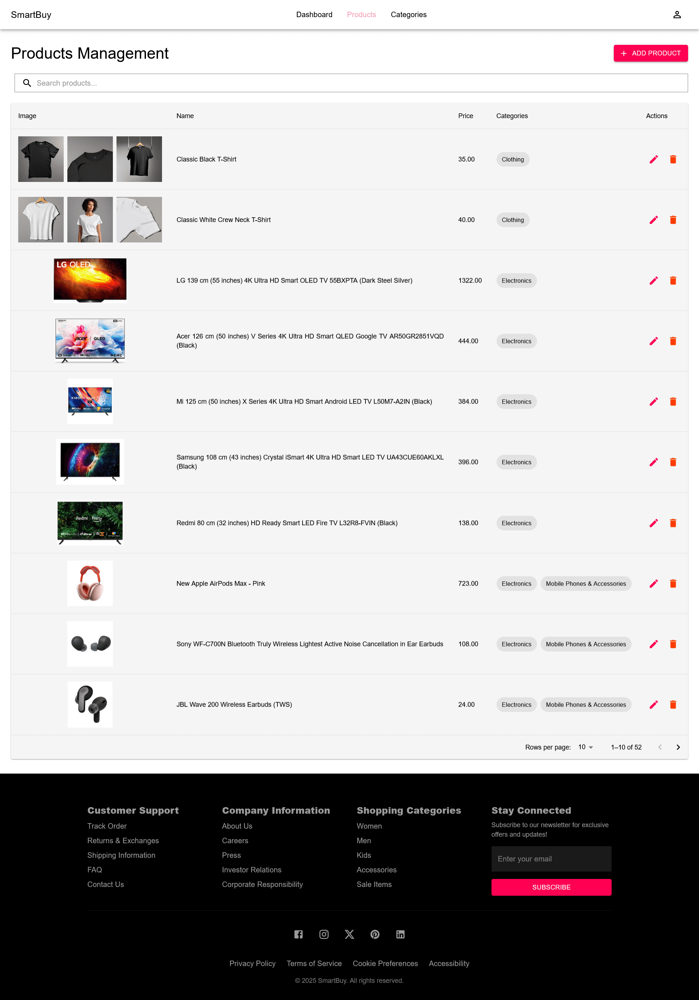

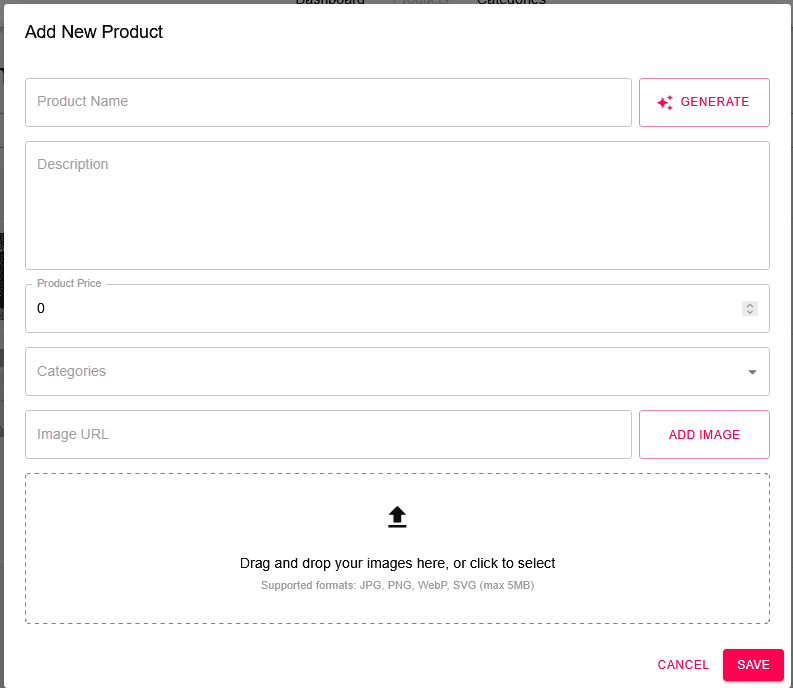

### 5. Home Page

- The main landing page for users, showcasing featured products and categories.

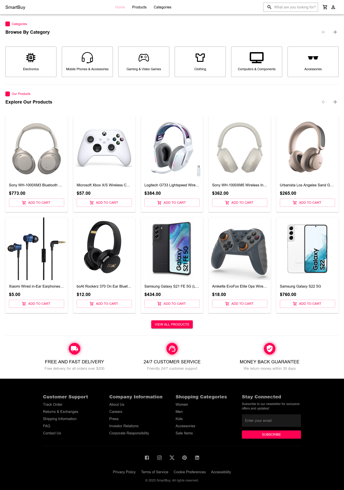

### 6. Product Page

- Displays detailed information about a specific product.

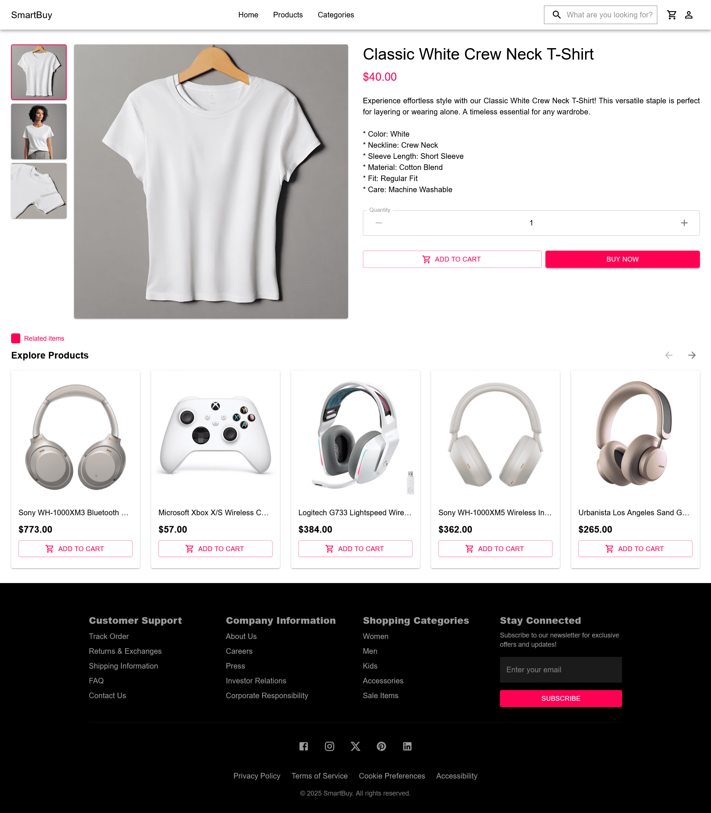

### 7. Products Page

- Lists all available products for browsing.

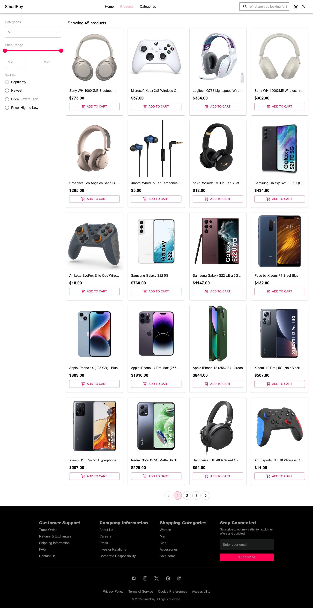

### 8. Cart Page 

- Shows the user's shopping cart with selected items.

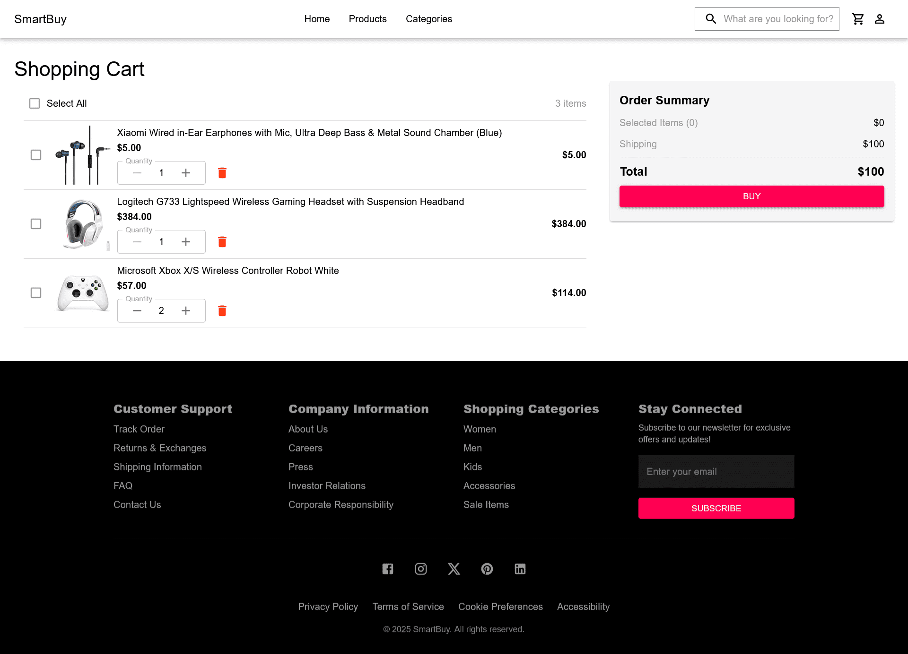

### 9. Category Page 

- Displays products within a specific category.

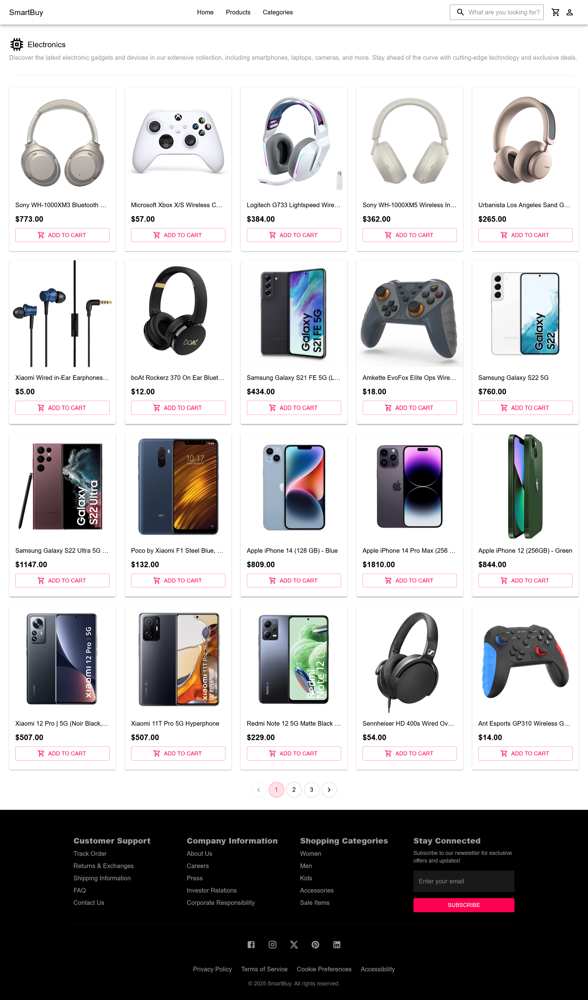